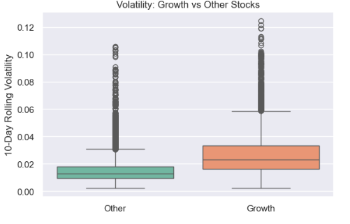
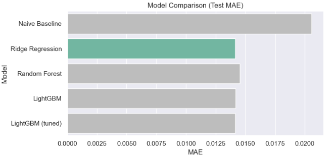

# 📊 **Stock Return Forecasting & Portfolio Analysis**

---

## 🔹 Project Overview

This project analyzes historical stock market data to evaluate whether machine learning models can improve short-term return prediction.

It combines:
- Time-series forecasting  
- Survival analysis (time to large price movements)  
- Ranking models for stock selection  

The goal is to build a **decision-support framework** for short-term portfolio allocation rather than a fully automated trading system.

---

## 🚀 Key Results

- Best model: **Ridge Regression**  
- Test MAE: **0.01413** (vs baseline ~0.02057)  
- ~30% improvement over naive model  
- Strong evidence of **low signal-to-noise ratio in financial data**  

---

## 🔹 Dataset Description

- **Source:** Yahoo Finance via `yfinance`  
- **Frequency:** Daily  
- **Period:** 2010 — present  
- **Universe:** 10 large-cap stocks  

### **Stocks included**

- AAPL — Apple  
- MSFT — Microsoft  
- AMZN — Amazon  
- GOOGL — Alphabet  
- META — Meta  
- NVDA — NVIDIA  
- TSLA — Tesla  
- JPM — JPMorgan  
- V — Visa  
- WMT — Walmart  

---

## 🔹 Project Structure

```
project/
│
├── notebooks/
│   └── stock-return-forecasting.ipynb
│
├── src/
│   └── tsfinanceplot.py
│
├── images/
│   └── (plots for README)
│
├── README.md
└── requirements.txt
```


---

## 🔹 Methodology

### 📌 Exploratory Data Analysis (EDA)

- Return distribution analysis  
- Volatility comparison across stocks  
- Correlation heatmap  
- Risk vs return analysis  
- Value-at-Risk comparison  
- Autocorrelation (ACF) analysis  
- Volatility clustering investigation  

**Key insight:**  
Financial returns are noisy, but **volatility clustering is clearly present**.

---

### 📌 Time-Series Forecasting

**Objective:** Predict next-day stock returns  

**Models:**
- Naive baseline (persistence)  
- Ridge Regression  
- Random Forest  
- LightGBM  

**Validation:**
- Time-based train/validation/test split  
- Evaluation metric: **MAE (Mean Absolute Error)**  

---

## 🔹 Model Performance

| Model | Test MAE |
|------|--------|
| Naive Baseline | 0.02057 |
| Ridge Regression | **0.01413** |
| Random Forest | 0.01454 |
| LightGBM | 0.01414 |

---

## 🔹 Key Insights

- Financial returns exhibit **low predictability**  
- Volatility clustering is present  
- Machine learning models outperform naive baseline  
- Improvements are **modest due to high noise**  
- Simpler models (Ridge) perform competitively  
- **Relative ranking is more reliable than absolute prediction**  

---

## 🔹 Business Interpretation

This project demonstrates that:

- Absolute return prediction is difficult due to market noise  
- However, **relative ranking of stocks is more actionable**  
- Combining forecasting + ranking improves decision-making  

The framework is better suited for:
- Portfolio allocation  
- Risk-aware stock selection  
- Short-term opportunity identification  

rather than fully automated trading.

---

## 🔹 Example Visualizations





--- 

## 🔹 Limitations

- No transaction costs considered
- No slippage modeling
- High noise in short-term predictions
- Small economic differences between models

--- 

## 🔹 Future Improvements

- Add transaction cost simulation
- Use walk-forward validation
- Include macroeconomic features
- Train sector-specific models
- Evaluate portfolio-level performance

--- 

## 🔹 Tech Stack
- Python
- pandas, numpy
- scikit-learn
- LightGBM
- matplotlib, seaborn
- yfinance
- lifelines
- statsmodels

--- 

## 🔹 Requirements

```bash
pip install yfinance pandas numpy matplotlib seaborn scikit-learn lightgbm lifelines statsmodels
```
---

## 🔹 How to Run

1. Clone repository  
2. Install dependencies  
3. Open notebook:  

```notebooks/stock_analysis.ipynb```

Plots are generated using:

src/tsfinanceplot.py